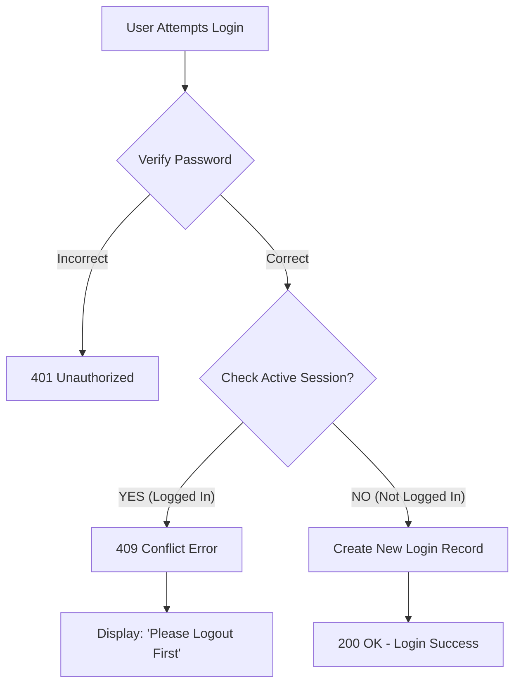

# EXCLUSIVE LOGIN IMPLEMENTATION - TECHNICAL GUIDE

## 1. OBJECTIVE
Implement "Exclusive Login" validation to ensure only one session is active per agent/user at any given time. If a user is already logged in, subsequent login attempts by the same user will be blocked until the previous session is logged out.

---

## 2. FILES MODIFIED
**File:** `routes/Login.py`

---

## 3. IMPLEMENTATION STEPS

### STEP 1: ADD HELPER FUNCTIONS
**Location:** In `routes/Login.py`, add these two functions after the existing `has_role` function.

**Code:**
```python
# Helper Function 1: Check Database Status
def check_agent_already_logged_in(agent_name: str, db: Session):
    """
    Query the database to see if an agent has an active session.
    Active Session = 'Login' status AND no 'logout_timestamp'
    """
    # 1. Query LoginLogout table
    active_login = db.query(LoginLogout).filter(
        LoginLogout.agent_name == agent_name
    ).order_by(LoginLogout.login_timestamp.desc()).first()  # Get latest record
    
    # 2. Check if active
    if active_login and active_login.agent_status == "Login" and active_login.logout_timestamp is None:
        return True, active_login
    
    return False, None


# Helper Function 2: Validation Logic
def validate_exclusive_agent_login(agent_name: str, db: Session):
    """
    Check status and raise error if already logged in.
    This acts as a "Gatekeeper" before allowing login.
    """
    is_logged_in, login_record = check_agent_already_logged_in(agent_name, db)
    
    if is_logged_in:
        # ❌ REJECT LOGIN - Return 409 Conflict
        logger.warning(f"Agent {agent_name} is already logged in")
        raise HTTPException(
            status_code=409,
            detail=f"Agent {agent_name} is already logged in. Please logout first before logging in again."
        )
    
    return True  # ✅ ALLOW LOGIN
```

---

### STEP 2: CALL VALIDATION IN LOGIN ROUTE
**Location:** Inside `authenticate_Login_and_users` function in `routes/Login.py`.

**Code for DirectorySearch Users (Agents/Supervisors):**
```python
# Inside authenticate_Login_and_users function...

    if directory_search:
        username_found = True
        if verify_password(authenticate.password, directory_search.password):
            correct_password = True
            
            # ✅ VALIDATION CALL ADDED HERE:
            validate_exclusive_agent_login(directory_search.user_id, db)

            logger.info(f"Authentication successful for username: {username_input} using DirectorySearch table")
            # ... rest of the code ...
```

**Code for Login Table Users (Admins):**
```python
# Further down in the same function...

    if not username_found:
        user = db.query(Login).filter(Login.username.ilike(username_input)).first()
        if user:
            username_found = True
            if verify_password(authenticate.password, user.password):
                correct_password = True
                
                # ✅ VALIDATION CALL ADDED HERE:
                validate_exclusive_agent_login(user.username, db)
                
                logger.info(f"Authentication successful for username: {username_input} using Login table")
                # ... rest of the code ...
```

---

### STEP 3: ADD STATUS CHECK ENDPOINT
**Location:** At the very end of `routes/Login.py`.

**Code:**
```python
# New API Endpoint to check status
@router.get("/agent/{agent_name}/status")
async def check_agent_login_status(agent_name: str, db: Session = Depends(get_db)):
    """
    Check if an agent is currently logged in.
    Returns JSON status.
    """
    is_logged_in, login_record = check_agent_already_logged_in(agent_name, db)
    
    return {
        "agent_name": agent_name,
        "is_logged_in": is_logged_in,
        "status": "ONLINE" if is_logged_in else "OFFLINE",
        "last_login": login_record.login_timestamp if login_record else None
    }
```

---

## 4. LOGIC FLOW DIAGRAM



---

## 5. DATABASE IMPACT
*   **Table Used:** `login_logout`
*   **Columns Checked:**
    *   `agent_name` (User ID)
    *   `agent_status` (Must be 'Login')
    *   `logout_timestamp` (Must be NULL)
*   **Changes:** No structural changes (schema remains same). Logic relies on existing data.

---

## 6. TESTING GUIDE

### Test 1: Successful Login
1.  **Action:** Login with username `suresh`.
2.  **Expected:** `200 OK` response.

### Test 2: Duplicate Login (Prevention)
1.  **Action:** Try login with `suresh` again (without logging out).
2.  **Expected:** `409 Conflict` error.
3.  **Message:** "Agent suresh is already logged in..."

### Test 3: Status Check
1.  **Action:** GET request to `/login/agent/suresh/status`
2.  **Expected:** `{"is_logged_in": true, "status": "ONLINE"}`

### Test 4: Successful Re-login
1.  **Action:** Call `/login/logout` for `suresh`.
2.  **Action:** Login again.
3.  **Expected:** `200 OK` (Login allowed after logout).

---

## 7. SUMMARY
This implementation successfully prevents concurrent sessions for the same user by checking the latest status in the `login_logout` table before creating a new session record. It covers all user types (Agents, Supervisors, Admins) without requiring UI modifications.
